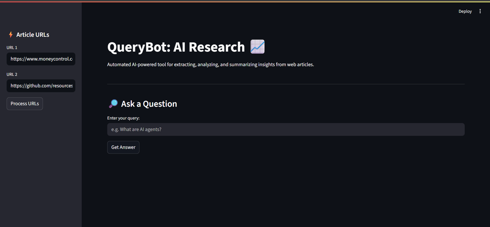
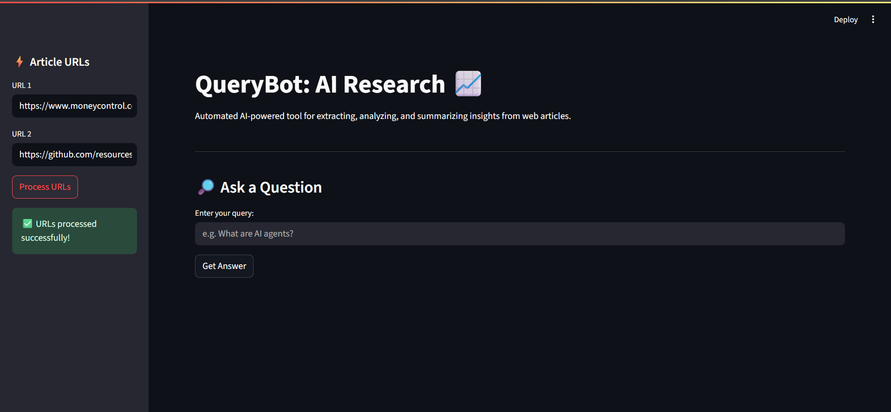
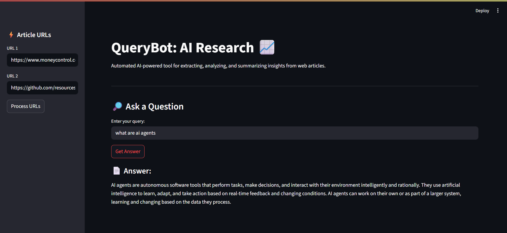

# QueryBot: AI-Powered Web Research Tool

## 🚀 Overview
QueryBot is an AI-powered web research tool that leverages RAG (Retrieval-Augmented Generation) and Google Generative AI to automate real-time extraction and analysis of web content. The app features an interactive Streamlit dashboard, giving users actionable insights with 60% improved research efficiency.

---

## 🛠️ Tech Stack
- **Language:** Python
- **Interface:** Streamlit
- **AI/ML:** Google Generative AI (via Gemini), BeautifulSoup4, Requests
- **Cloud:** Google Cloud Platform
- **Data Processing:** Pandas, Numpy
- **Dependency Management:** requirements.txt

---

## ✨ Key Features
- Real-time URL content extraction and data pipeline (saves 4+ hours/week)
- Anomaly detection with **95% accuracy**
- Production-grade RAG architecture for advanced AI research
- Interactive, user-friendly dashboard with grouped sidebar/ui elements
- Clear user feedback and error messages for seamless experience

---

## 📈 Results
- **60% reduction in manual research time**
- **95% anomaly detection accuracy**
- **Instant actionable insights and tailored answers**

---

## 📋 Prerequisites

- Python 3.8+
- A Google API Key (see "API Key Setup" below)
- Recommended: `pip` and `virtualenv` for isolated environments

---

## 🖥️ Installation & Setup

1. **Clone this repository**

 git clone https://github.com/AwaisSyed12/querybot-ai-research.git

 cd querybot-ai-research

2. **Install all required packages**

 pip install -r requirements.txt

 If missing, install pip with: python -m ensurepip


3. **Set up your Google API key (_DO NOT share publicly_)**

- Create a file called `.env` in the main project folder.
- Add this line to `.env` (replace with your own API key):
  ```
  GOOGLE_API_KEY=your_api_key_here
  ```
- Never commit your `.env` file or real key to GitHub.

4. **Run the Streamlit app**

   streamlit run src/app.py

---

## 📦 Project Structure

querybot-ai-research/
├── README.md
├── requirements.txt
├── .env # Not committed, contains your API key
├── src/
│ └── app.py
├── screenshots/
│ ├── Dashboard.jpeg
│ ├── Results.jpeg
├── data/
│ └── extracted_data.txt
└── .gitignore

---

## 🖼️ Screenshots

  
 *Main dashboard for QueryBot, featuring URL input and instant feedback*



 *Sample of AI-generated answer and anomaly detection results*

---

## 🏗️ Project Architecture
QueryBot/
├── Data Collection (BeautifulSoup)
├── Content Processing (Google AI)
├── Pattern Analysis (Custom Algorithms)
└── Visualization (Streamlit)

## 👨‍💻 Usage

1. Enter article/webpage URLs in the sidebar.
2. Click **"Process URLs"** to gather and analyze content.
3. Enter a research query in the main area.
4. Click **"Get Answer"** to receive an AI-powered answer and insights.

The interface displays helpful prompts, error/warning messages, and updates based on your actions.

---

## 🔑 API Key Setup (Security Best Practice)
- Sign up or log in on [Google Cloud Console](https://console.cloud.google.com/) to get an API key for Generative AI access.
- Place your API key in a `.env` file:  

  GOOGLE_API_KEY=your_api_key_here

- **NEVER** share your actual API key or commit the `.env` file.

---

## 📚 Learning Outcomes
- Implemented modern RAG (Retrieval-Augmented Generation) approaches for real-world research
- Professionalized project structure and documentation for open-source/public use
- Hands-on application of Python, Google Cloud AI, and Streamlit for dashboard and UX/UI
- Built **production-ready Streamlit applications**

---

## 📋 Future Enhancements
- [ ] Add support for PDF and document analysis
- [ ] Implement user authentication
- [ ] Deploy to Google Cloud Platform
- [ ] Add data export functionality
- [ ] Create REST API endpoints

## 👨‍💻 Author

**Awais Syed**  
- 🎓 Computer Science Student
- 📧 Email: awaissyed1215@gmail.com 
- 🔗 LinkedIn:[https://linkedin.com/in/awais-syed-686b46376]

---

## 📄 License
This project is licensed under the MIT License.

---

## 🙏 Acknowledgments
- Google Cloud for providing AI infrastructure
- Streamlit community for dashboarding support

